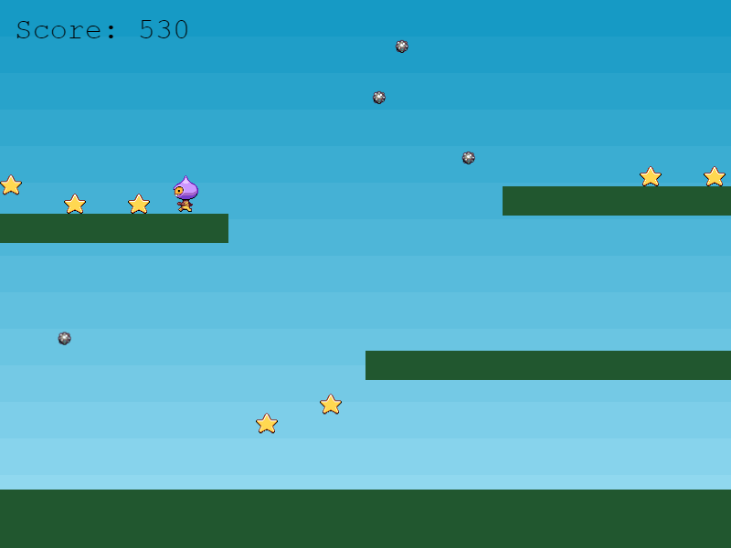
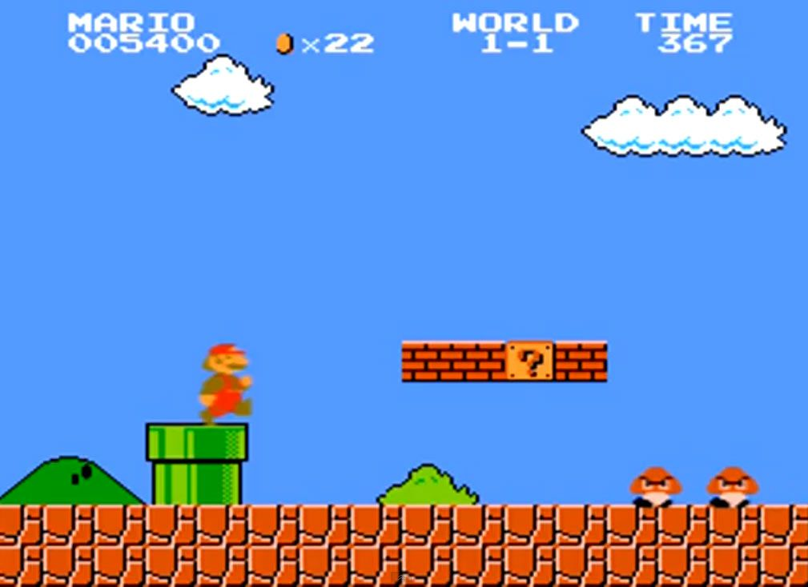

# Beginner-Platformer

## Introduction

### Game Summary Pitch

 Food Platformer is a simple game that is themed around food, the player will collect food items to get enough points to reach the next level.  The player must also evade obstacles that appear while gathering the food but will also keep an eye out for powerups to help along the way.

### Inspiration

**Phaser Platformer**

This was built off the Phaser tutorial and was added the theme of food to it. This platformer is my base but also inspiration on why I started to make games using Phaser. The simplicity of this game and the versatile features you can add is all too amazing for a beginner like me. 

**Super Mario Bros.**

One of my favorite platformers I played as a kid and would like to take some powerups and idea from this game.
